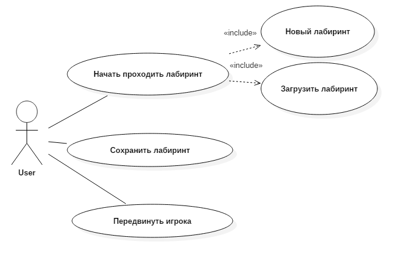
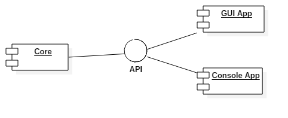

# Labyrinth navigation.

## Задание
Навигация по лабиринту. Программа должна перемещать игрока по лабиринту, не ломая стены и тд. Цель - выйти из лабиринта. 

Второй абзац -- что определено вами (выбранные исчерпывающие правила игры, требования к модели, редактору и т.п.)

## Концепция (vision statement)
Создается с точки зрения заказчика и конечных пользователей. Цель артефакта -- описать, как должен выглядеть успешный результат проекта. Иначе говоря, если проект завершается успешно, то как в этом случае должен выглядеть готовый продукт? Какими он обладает ключевыми характеристиками и функциями и как они могуть помочь пользователям выполнять их задачи? Концепция определяет на уровне руководства, в каком случае руководство может признать, что цель работы достигнута.

## Минимально работоспособный продукт (Minimum viable product)
Программа дожна выводить на экран лабиринт, с возможностью перемещения игрока

## Диаграмма прецедентов использования

## Диаграмма последовательностей

## Диаграмма компонентов

